# Texas Hold'em Poker - Project Documentation

[Play Now!](https://9henrychung8.itch.io/prototype-texas-holdem-poker)

---

### 1. Main Menu

The poker game begins at a Main Menu Scene with two buttons:

- **Play**: Start the game
- **Tutorial**: Learn the rules

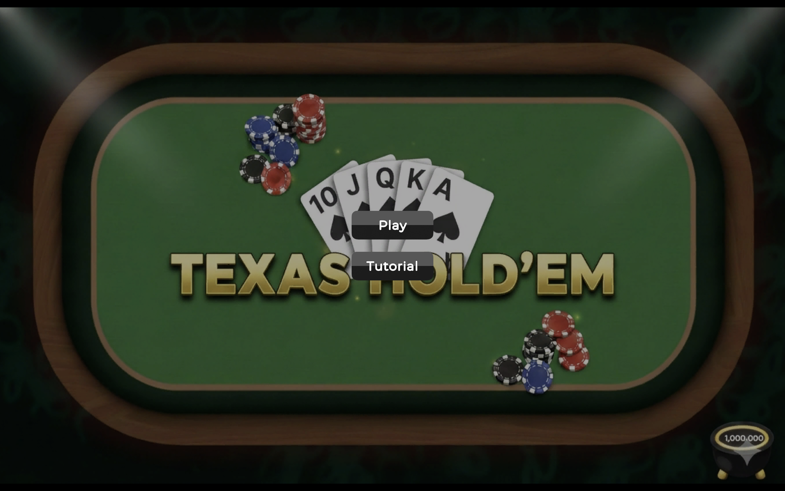

---

### 2. Tutorial Scene

The tutorial teaches players poker fundamentals:

- Hand rankings
- Blinds
- Player actions (Call, Raise, Fold)
- How to form the best hand from seven cards

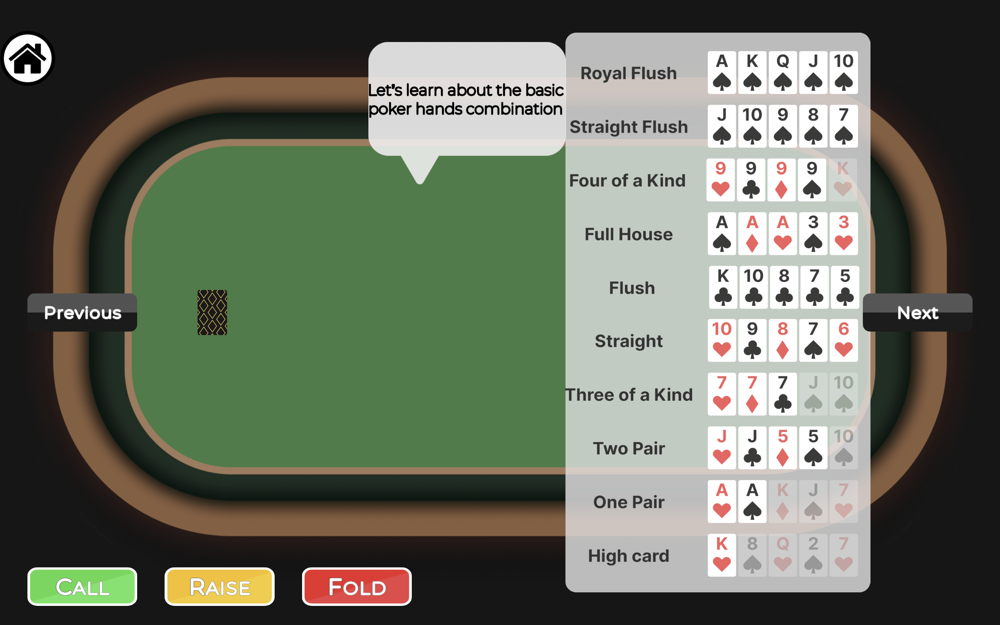

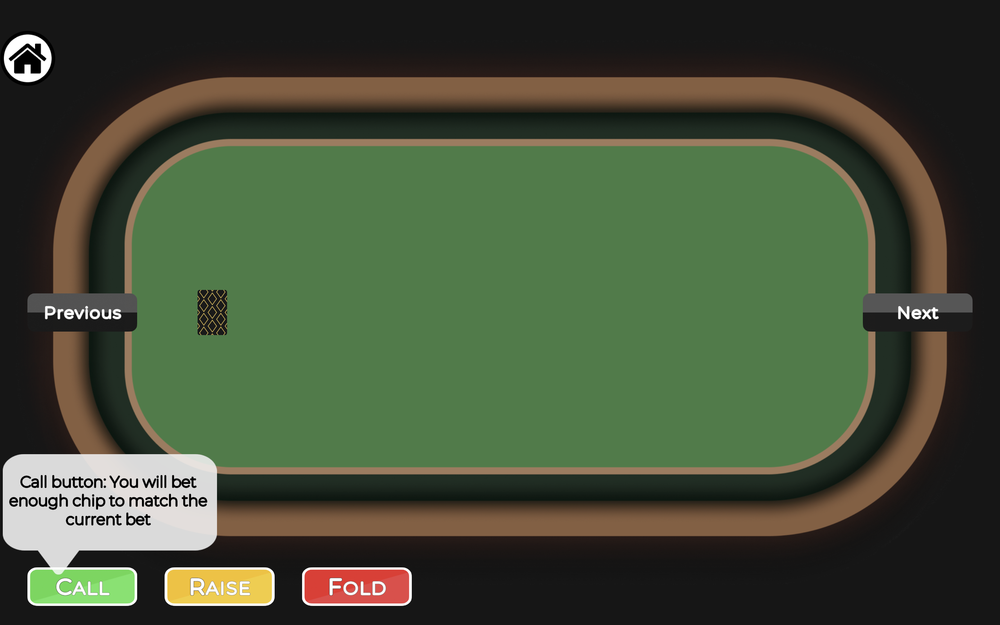

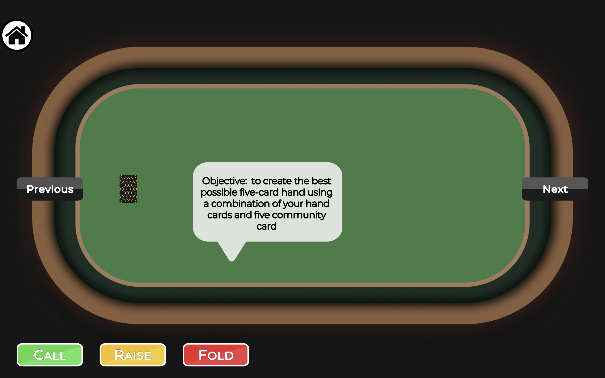


At the end of the tutorial, a button appears that lets the player start the game immediately.

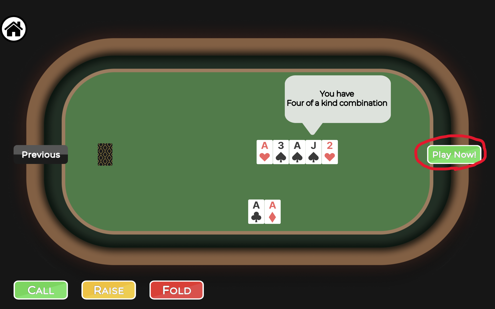

---

### 3. Gameplay Scene

The gameplay scene includes:

1. **Total pot amount**
2. **Win probability**
3. **Player's current hand rank**
4. **Bettor chip** (indicates whose turn it is)
5. **Single opponent**

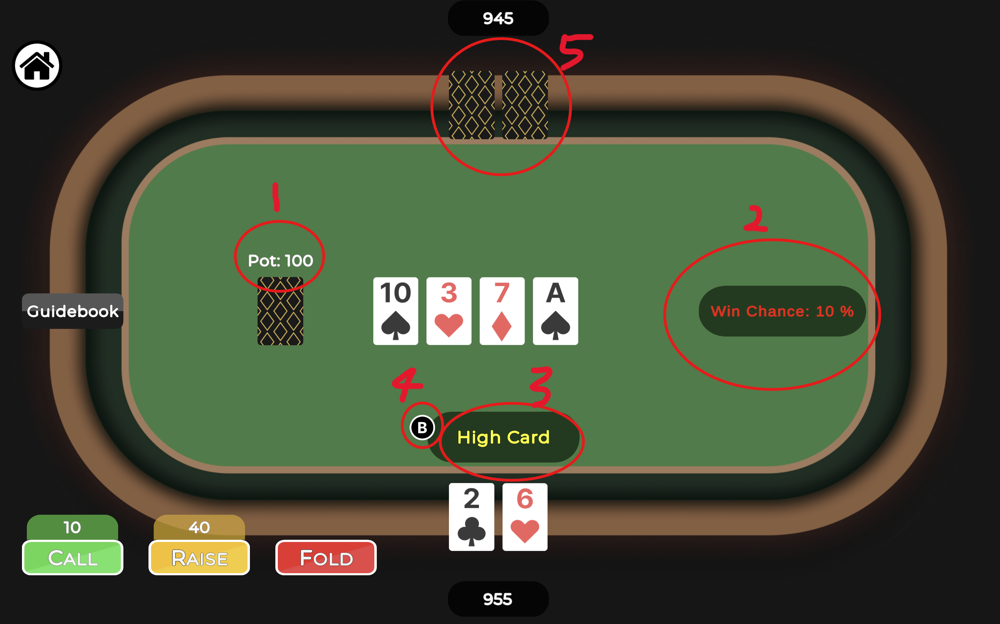

### Action Buttons

The numbers above the Call and Raise buttons show the exact chip amount the player is going to bet. If no chips are required to call, the Call text switches to **Check**.


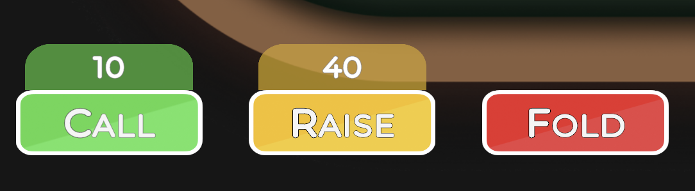

### Guidebook

The Guidebook button is a toggle that opens a sheet displaying all hand rank combinations for beginners. The hand rank text is updated dynamically - each time the phase advances and community cards are dealt, the text reflects the player's highest hand rank combination.

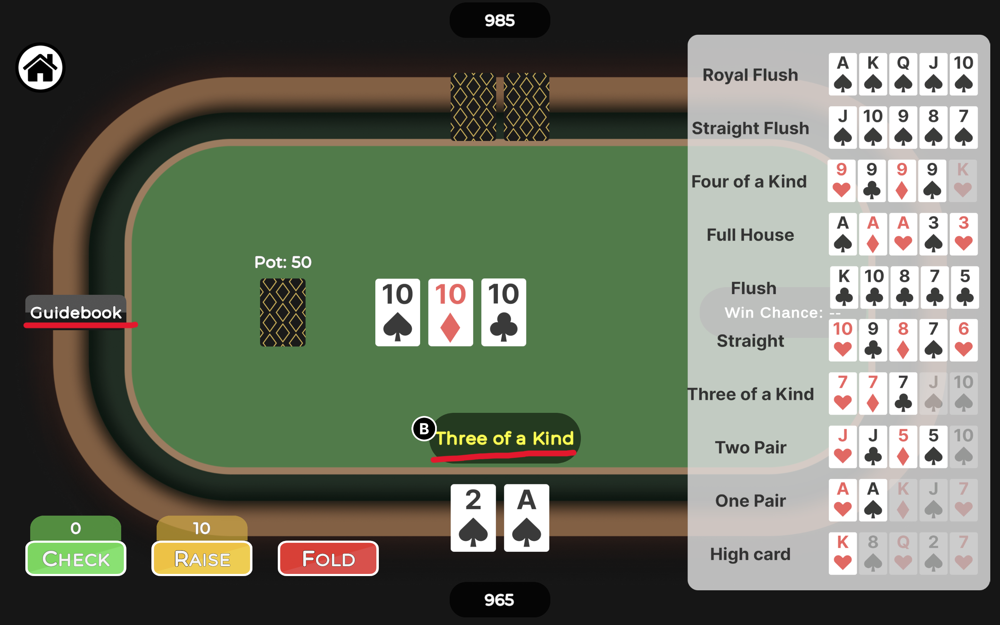

### Showdown

After showdown, the opponent's hand is revealed, an overlay covers the game, shows the appropriate text with highlighted winning cards, and displays a Restart button that lets the player play again.

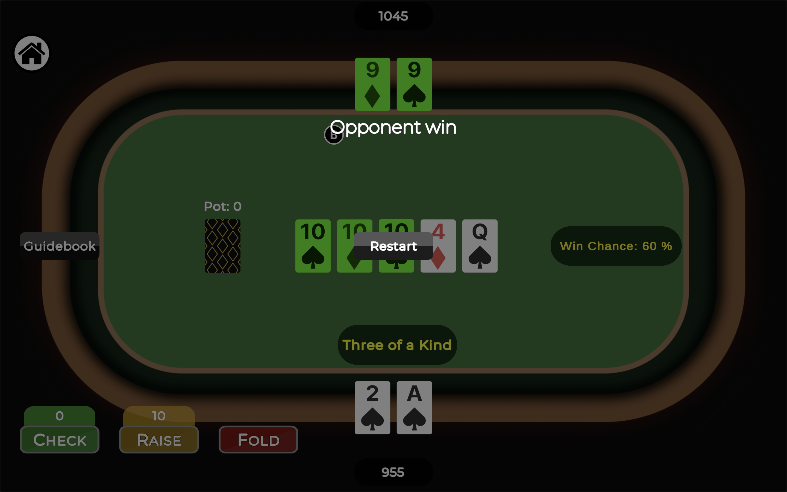

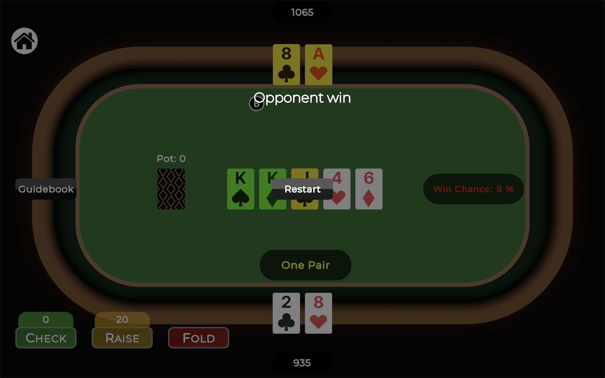

### Hand Evaluation

Each player's seven cards are evaluated to determine their best hand, and the results are compared to see which is higher. The **kicker** comes into play when players have the same hand rank (e.g., both have one pair in community, and this is the best hand). It checks the remaining unused cards in the combination to determine which hand is stronger. The winning hand is highlighted in **green**, and the kickers are highlighted in **yellow**.

---

### 4. AI Behavior

The AI uses the Random library to pick an action based on simple probability checks.

```csharp
bool tryRaise = !opponent.HasAllIn && !player.HasAllIn && Random.value < 0.5f;
bool tryFold = !opponent.HasAllIn && !player.HasAllIn && Random.value < 0.2f;
if (tryRaise) HandleRaise(opponent, player);
else if (tryFold) HandleFold(opponent, opponentCardsHolder);
else HandleCall(opponent, player);
```

The `HasAllIn` check blocks raise or fold logic because if someone is all-in, the only valid action is to call.

---

### 5. Game Flow

The game follows standard poker phases: **Preflop → Flop → Turn → River → Showdown**

### Key Components

- Each player has a `HasActed` boolean
- All players are stored in a list
- `DealerIndex` and `BettorIndex` integers track whose turn it is

### Phase Details

**Preflop**: `DealerIndex` and `BettorIndex` are used to automatically post the small blind and big blind.

**Normal Turns**: Players can take standard actions (call, raise, fold). Once all players' `HasActed` are true, the game advances to the next phase.

**Restart**: After Showdown, the `Reset` function resets all players' `HasActed` to false and reinitializes `DealerIndex`, `BettorIndex`, and other necessary states for a new round.

---

### 6. Player Action Buttons

### Call

Call amount is calculated as the highest bet in this turn minus the amount the calling player has already bet.

```
Call Amount = HighestBetThisRound - PlayerBetThisRound
```

Once all players have acted, the turn advances to the next phase.

### Raise

Raise requires betting the previous player's current-turn bet plus the larger of the big blind or that bet. In other words, the raise will be at least double the previous player's bet, or equal to the big blind if the previous player hasn't bet this round.

```
Raise Amount = other.BetThisRound + Max(bigBlind, other.BetThisRound)
```

After Raise, all players' `HasActed` flags reset to false except the raiser, so unlike a Call, the game does not advance to the next phase.

### Fold

Fold sets a player's `HasFolded` to true, and this player is excluded from the `HasActed` checks used to advance phases. It also helps track how many players remain. If only one player is left, that player is declared the winner.

---

### 7. All-In

If a player bets all their chips and has none left, they are considered **all-in**, and all other players can only call. Only the Call (Check) button is activated in this state.

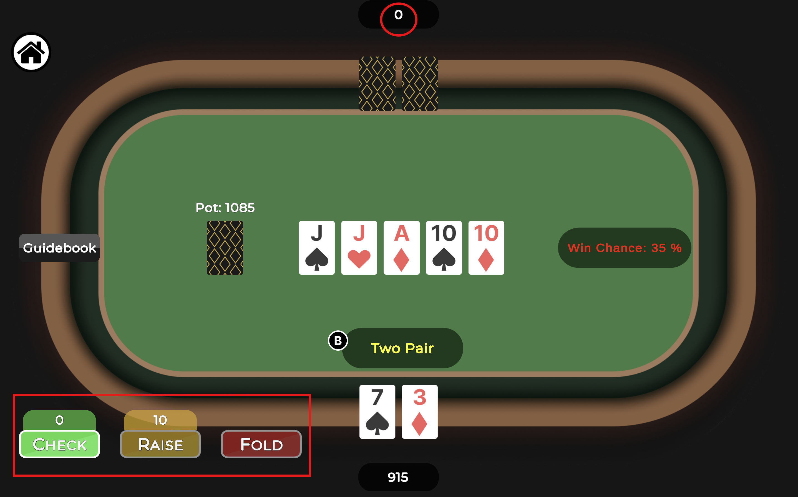
